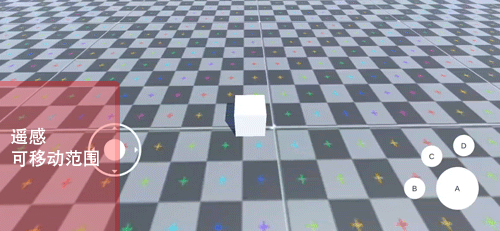
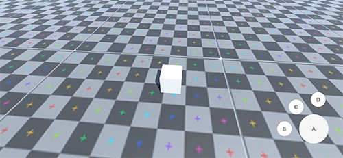
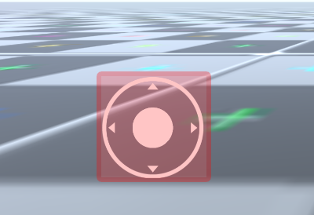

# Unity Joystick手势操作

作者:无聊

---
## 实现原因
由于制作Demo的需要，第三方的相关插件都过于重量级，所以就自己实现了一个简单的手势操作方案。
## 基本功能

本文实现了一个简易的Unity JoyStick手势操作，主要实现三个功能，操纵杆（Joystick）、相机旋转(Rotate)与缩放(Scale)。

基本逻辑结构如下：

	protected void LateUpdate()
	{
	     AroundByMobileInput();
	}

	void AroundByMobileInput()
	{
	    if (Input.touchCount > 0 && Input.touchCount <= 2)
	    {
	        for (int i = 0; i < Input.touchCount; i++)
	        {
	            if (Input.touches[i].phase == TouchPhase.Began)
	            {
	                判断可能存在缩放操作的计时标记

	                如果在屏幕左半边，则初始化Joystick
	                    记录触摸信息，包括位置、ID

	                如果在屏幕右半边，则初始化Rotate
	                     记录触摸信息，包括位置、ID
	                	 计时器增加 不能操作缩放
	            }
	            else if (Input.touches[i].phase == TouchPhase.Moved || Input.touches[i].phase == TouchPhase.Stationary)
	            {
	                根据ID来执行相应操作，Joystick还是Rotate操作

	                计时器操作
	            }
	            else if (Input.touches[i].phase == TouchPhase.Canceled || Input.touches[i].phase == TouchPhase.Ended)
	            {
	                同样根据ID来执行最后的收尾工作
	            }
	        }
	    }

	    根据计时器的时间判断是否可以进行缩放操作 canScale

		if (canScale)
		{
			双指缩放操作
		}
	}


手势操作的实现均是根据Unity提供的Input的TouchPhase来判断状态，然后三个主要功能Joystick、Rotate和Scale根据其状态和Input的Position变换等各种属性来进行操作。

下面分别列出三个主要功能，各自单独的具体代码实现。

#### Joystick

<font color=red>Joystick的实现原理是记录触摸点第一帧的初始位置，显示操纵杆背景图。然后根据之后触摸的位置与初始位置间的相对位移计算出偏移量，即是主角需要使用的位移值，显示操纵杆。最后当触摸停止时候清空数据。</font>

    public GameObject m_OnPad;// Joystick的GameObject
    public Image m_Bottom;// 背景图片
    public Image m_Stick;// 操纵杆图片

    private Vector3 m_BeginPos = Vector2.zero;// Joystick初始化位置
    private Vector2 m_CenterPos = Vector2.zero;
    private Vector3 m_Dir = Vector3.zero;// 最后计算相对的偏移距离，主角需要使用的位移值

    private float m_DisLimit = 1.0f;// 用于限定操纵杆在一定范围内
    private int m_MoveFingerId = -1;
    private bool m_HasMove = false;

    protected virtual void Start()
    {
        m_DisLimit = m_Bottom.rectTransform.sizeDelta.x / 2;
    }

    protected void AroundByMobileInput()
    {
        if (Input.touchCount > 0 && Input.touchCount <= 2)
        {
            for (int i = 0; i < Input.touchCount; i++)
            {
                if (Input.touches[i].phase == TouchPhase.Began)
                {
                    if (!EventSystem.current.IsPointerOverGameObject(Input.touches[i].fingerId))
                    {
                        m_MoveFingerId = Input.touches[i].fingerId;
                        m_BeginPos = Input.touches[i].rawPosition;

                        showJoyStick();
                    }
                }
                else if (Input.touches[i].phase == TouchPhase.Moved || Input.touches[i].phase == TouchPhase.Stationary)
                {
                    if (Input.touches[i].fingerId == m_MoveFingerId)
                    {
                        setStickCenterPos(Input.touches[i].position);
                    }
                }
                else if (Input.touches[i].phase == TouchPhase.Canceled || Input.touches[i].phase == TouchPhase.Ended)
                {
                    if (Input.touches[i].fingerId == m_MoveFingerId)
                    {
                        hideJoyStick();
                        m_MoveFingerId = -1;
                    }
                }
            }
        }
    }

    Vector2 convertTouchPosToUIPos(Vector2 touchPosition)
    {
        Vector2 localPoint;
        RectTransformUtility.ScreenPointToLocalPointInRectangle(m_OnPad.transform as RectTransform, touchPosition, null, out localPoint);
        return localPoint;
    }

    void showJoyStick()
    {
        m_Bottom.gameObject.SetActive(true);
        m_Stick.gameObject.SetActive(true);
        m_OnPad.SetActive(true);
        m_CenterPos = convertTouchPosToUIPos(m_BeginPos);
        m_Bottom.rectTransform.localPosition = m_CenterPos;
        m_Stick.rectTransform.localPosition = m_CenterPos;

        m_Dir.x = 0;
        m_Dir.z = 0;
        m_Dir.Normalize();
    }

    void hideJoyStick()
    {
        m_OnPad.SetActive(false);
        m_Bottom.rectTransform.localPosition = Vector2.zero;
        m_Stick.rectTransform.localPosition = Vector2.zero;

        m_Dir.x = 0;
        m_Dir.z = 0;
        m_Dir.Normalize();
    }

    void setStickCenterPos(Vector2 touch)
    {
        Vector2 pos = convertTouchPosToUIPos(touch);

        float dis = Vector2.Distance(pos, m_CenterPos);
        if (dis > m_DisLimit)
        {
            Vector2 dir = pos - m_CenterPos;
            dir.Normalize();
            dir * = m_DisLimit;
            pos = m_CenterPos + dir;
        }
        m_Stick.transform.localPosition = pos;

        m_Dir.x = pos.x - m_CenterPos.x;
        m_Dir.z = pos.y - m_CenterPos.y;
        m_Dir.Normalize();
    }

#### Rotate

<font color=red>Rotate同理，也是根据触摸点第一帧的初始位置，与之后的位置的相对位移来计算相机的旋转量。</font>

    public Vector2 CurrentAngles;
    private Vector2 targetAngles;

    private int m_RotateFingerId = -1;
    private Vector2 m_PreRotatePos;// 用于保存上一帧手指的触碰位置
    private bool m_HasRotate = false;

	protected virtual void Start()
	{
	    CurrentAngles = targetAngles = transform.eulerAngles;
	}

	protected void AroundByMobileInput()
	{
	    if (Input.touchCount > 0 && Input.touchCount <= 2)
	    {
	        for (int i = 0; i < Input.touchCount; i++)
	        {
	            if (Input.touches[i].phase == TouchPhase.Began)
	            {
	                if (!EventSystem.current.IsPointerOverGameObject(Input.touches[i].fingerId))
	                {
	                    if (!m_HasRotate)
	                    {
	                        m_RotateFingerId = Input.touches[i].fingerId;
	                        m_PreRotatePos = Input.touches[i].position;
	                        m_HasRotate = true;
	                    }
	                }
	            }
	            else if (Input.touches[i].phase == TouchPhase.Moved || Input.touches[i].phase == TouchPhase.Stationary)
	            {
	                if (Input.touches[i].fingerId == m_RotateFingerId)
	                {
	                    Vector2 delta = Input.touches[i].position - m_PreRotatePos;
	                    targetAngles.y += delta.x;
	                    targetAngles.x -= delta.y;
	                    //Range.
	                    //targetAngles.x = Mathf.Clamp(targetAngles.x, angleRange.min, angleRange.max);
	                    m_PreRotatePos = Input.touches[i].position;

	                }
	            }
	            else if (Input.touches[i].phase == TouchPhase.Canceled || Input.touches[i].phase == TouchPhase.Ended)
	            {
	                if (Input.touches[i].fingerId == m_RotateFingerId)
	                {
	                    m_RotateFingerId = -1;
	                    m_HasRotate = false;
	                }
	            }
	        }
	    }

	    //Lerp.
	    CurrentAngles = Vector2.Lerp(CurrentAngles, targetAngles, Time.deltaTime);

	    //Update transform position and rotation.
	    transform.rotation = Quaternion.Euler(CurrentAngles);
	}

#### Scale

<font color=red>Scale则是根据两根手指触碰的距离与初始距离的相对大小来计算相机的位移。</font>

	public Transform target;// 主角

    public float CurrentDistance;
    private float targetDistance;

    private bool m_IsSingleFinger = true;

    private Vector2 oldPosition1;// 记录上一次手机触摸位置判断用户是在左放大还是缩小手势
    private Vector2 oldPosition2;

	protected virtual void Start()
	{
	    CurrentDistance = targetDistance = Vector3.Distance(transform.position, target.position);
	}

	protected void AroundByMobileInput()
	{
	    if (Input.touchCount == 1)
	    {
	        m_IsSingleFinger = true;
	    }

	    if (Input.touchCount > 1)
	    {
	        // 计算出当前两点触摸点的位置  
	        if (m_IsSingleFinger)
	        {
	            oldPosition1 = Input.GetTouch(0).position;
	            oldPosition2 = Input.GetTouch(1).position;
	        }

	        if (Input.touches[0].phase == TouchPhase.Moved && Input.touches[1].phase == TouchPhase.Moved)
	        {
	            var tempPosition1 = Input.GetTouch(0).position;
	            var tempPosition2 = Input.GetTouch(1).position;

	            float currentTouchDistance = Vector3.Distance(tempPosition1, tempPosition2);
	            float lastTouchDistance = Vector3.Distance(oldPosition1, oldPosition2);

	            // 计算上次和这次双指触摸之间的距离差距  
	            // 然后去更改摄像机的距离  
	            targetDistance -= (currentTouchDistance - lastTouchDistance) * Time.deltaTime * mouseSettings.wheelSensitivity;

	            // 备份上一次触摸点的位置，用于对比  
	            oldPosition1 = tempPosition1;
	            oldPosition2 = tempPosition2;
	            m_IsSingleFinger = false;
	        }
	    }

		//Range
	    //targetDistance = Mathf.Clamp(targetDistance, distanceRange.min, distanceRange.max);
	    CurrentDistance = Mathf.Lerp(CurrentDistance, targetDistance, Time.deltaTime);

	    transform.position = target.position - transform.forward * CurrentDistance;
	}

---

## 问题解决

三个主要功能的逻辑很简洁，但是编写过程中也遇到了一些问题，一些是实现单独功能方面的，一些是合并的时候各自操作会冲突的。

### 1.

手势操作需要兼容手指触碰和外设手柄。但是在使用外设手柄的时候有时候遇到Joystick卡住的问题，<u>如图1</u>


<br/><font size=2>图1. 使用外设手柄Joystick卡住</font></br>

原因是在外设手柄或虚拟按键的时候，遥感的触碰事件初始获取的一定是设定的虚拟区域的中心位置，由于之前使用```m_BeginPos = Input.touches[i].position```获取的是当前触摸的位置，当摇杆移动过快时，导致第一次获取的位置并不是虚拟区域的中心。把此点初始化成了摇杆的中心，而虚拟遥感的移动位置无法超过虚拟区域，造成遥感被卡住。<u>如图2</u>。


<br/><font size=2>图2. 外设手柄的遥感可移动范围</font></br>

而Unity提供了另外一个方法Input.touches.rawPosition，这个方法获取的是触摸事件的初始值。<font color=red>则更改初始化位置的代码为```m_BeginPos = Input.touches[i].rawPosition;```之后，再使用外设手柄的时候，Joystick的初始化位置就固定为手机设定的初始位置。</font>问题解决，<u>如图3</u>。


<br/><font size=2>图3. 使用外设手柄出现的问题被解决</font></br>

	if (Input.touches[i].phase == TouchPhase.Began)
	{
			if (!EventSystem.current.IsPointerOverGameObject(Input.touches[i].fingerId))
			{
					m_MoveFingerId = Input.touches[i].fingerId;
					m_BeginPos = Input.touches[i].rawPosition;//以前错误的使用了Input.touches[i].position

					showJoyStick();
			}
	}
<font color=red>rawPosition是触摸事件的初始位置，而position是当前移动到的位置。</font>

### 2.

手势操作与UI布局有时会产生冲突，<u>如图4</u>。


<br/><font size=2>图4. 手势操作与UI布局冲突</font></br>

针对这个问题，Unity已提供很好的解决方法。Unity提供了EventSystem.IsPointerOverGameObject来判断手势操作是否点击到了UI上。<font color=red>直接在所有手势初始化操作的时候增加一个判断即可: </font>

	if (!EventSystem.current.IsPointerOverGameObject(Input.touches[i].fingerId))

<font color=red>EventSystem.current.IsPointerOverGameObject方法针对的是Unity提供UGUI的，并且需要勾选组件上的Raycast Target才能生效。</font>

修改后点击按钮与手势操作不再冲突，<u>如图5</u>。


<br/><font size=2>图5. 手势操作与UI布局不再冲突</font></br>

### 3.

Rotate操作最初使用的是Input.GetAxis接口来判断相机的旋转角度targetAngles。这样做会导致Joystick和Rotate操作会冲突，<u>如图6</u>。


<br/><font size=2>图6. Joystick和Rotate操作冲突</font></br>

<font color=red>原因是，Input.GetAxis接口并没有细化到是第几个手指触碰，所以如果同时有两个手指触碰屏幕的时候会产生冲突。</font>

<br/><font color=red>因此将Input.GetAxis接口换成Input.touches的操作即可。</font> 具体代码如下：</br>

	// 修改前
	targetAngles.y += Input.GetAxis("Mouse X");
	targetAngles.x -= Input.GetAxis("Mouse Y");

	// 修改后
	Vector2 delta = Input.touches[i].position - preRotatePos;
	targetAngles.y += delta.x;
	targetAngles.x -= delta.y;
	preRotatePos = Input.touches[i].position;

Input.touches可以根据touches[i]判断是触碰点的位置和顺序，然后根据ID和顺序限制触碰点只能单独进行Joystick操作或者Rotate操作，根据Input.touches.position的变换来计算旋转角度。更改后<u>如图7</u>，问题解决。


<br/><font size=2>图7. Joystick和Rotate操作不再冲突</font></br>

### 4.

Joystick操作中，操作杆的位置需要限定在背景图的范围之内。


<br/><font size=2>图8. 操作杆的移动范围</font></br>
<br/><font color=red>解决该问题使用Unity提供的接口RectTransformUtility.ScreenPointToLocalPointInRectangle，该方法是将屏幕空间上的点转换为RectTransform的局部空间中位于其矩形平面上的位置。</font></br>

其中m_OnPad传入是Joystick的背景GameObject，touchPosition是触碰的位置，即将当前Joystick的触碰位置传入，转换成背景图的RectTransform局部空间的坐标，代码如下：

    Vector2 convertTouchPosToUIPos(Vector2 touchPosition)
    {
        Vector2 localPoint;
        RectTransformUtility.ScreenPointToLocalPointInRectangle(m_OnPad.transform as RectTransform, touchPosition, null, out localPoint);
        return localPoint;
    }

然后，在显示Joystick的操作杆位置的时候，然后限定局部坐标的位置与中心的距离，就可以将操作杆设置在圆盘的范围内。m_CenterPos是触碰第一帧的时候记录的初始化坐标，也需要转换成局部坐标；m_DisLimit是限定局部坐标的位置与中心的距离，需要初始化，具体代码如下：

	void setStickCenterPos(Vector2 touchPosition)
    {
        Vector2 pos = convertTouchPosToUIPos(touchPosition);

        float dis = Vector2.Distance(pos, m_CenterPos);
        if (dis > m_DisLimit)//
        {
            Vector2 dir = pos - m_CenterPos;
            dir.Normalize();
            dir * = m_DisLimit;
            pos = m_CenterPos + dir;
        }
        m_Stick.transform.localPosition = pos;
    }

### 5.

Scale与Joystick和Rotate冲突，即在两个手指同时操作的情况下，三个操作同时进行，<u>如图9</u>。


<br/><font size=2>图9. Scale与Joystick和Rotate冲突</font></br>

而解决问题很简单，则是考虑到需求，将需要双指操作的Scale操作和两个单指操作的Joystick移动和Rotate区分开来即可。<font color=red>原理是使用一个计时器记录两个触碰点的间隔时间，如果这个时间超过了0.1s，则禁止Scale操作；同样如果在Scale操作的时候也禁止Joystick和Rotate操作。</font>

伪代码如下：

	bool m_Timer = false;// 判断计时器开始与否
	float m_IntervalTime = 0;// 记录间隔时间
	bool canScale = false;// 判断能否进行Scale操作

	void AroundByMobileInput()
	{
	    if (Input.touchCount > 0 && Input.touchCount <= 2)
	    {
	        for (int i = 0; i < Input.touchCount; i++)
	        {
	            if (Input.touches[i].phase == TouchPhase.Began)
	            {
	                if (i == 0)
                    {
                        m_Timer = true;
                        m_IntervalTime = 0;
                    }
                    else if (i == 1)
                    {
                        m_Timer = false;
                    }

	                初始化Joystick
					初始化Rotate
	            }
	            else if (Input.touches[i].phase == TouchPhase.Moved || Input.touches[i].phase == TouchPhase.Stationary)
	            {
	                根据ID来执行相应操作，Joystick还是Rotate操作

	                if (m_Timer)
                    {
                        m_IntervalTime += Time.unscaledDeltaTime;
                    }
	            }
	            else if (Input.touches[i].phase == TouchPhase.Canceled || Input.touches[i].phase == TouchPhase.Ended)
	            {
	                同样根据ID来执行最后的收尾工作
	            }
	        }
	    }

        if (m_IntervalTime < 0.1f)
        {
            canScale = true;
        }
        else
        {
            canScale = false;
        }

		if (canScale)
		{
			双指缩放操作
		}
	}

<font color=red>同时，如果需要的话可以更进一步限制双指Scale操作只在屏幕右半边才有效，这样只需在初始化操作的时候进行判断即可
```
if (Input.touches[i].position.x > Screen.width / 2)
```

</font>修改之后问题解决，<u>如图10&11</u>。


<br/><font size=2>图10. Scale与Joystick和Rotate不再冲突</font></br>


<br/><font size=2>图11. 限定Scale操作在右半边</font></br>

### 6.
在上文功能的具体代码中可看到，为每种操作都<font color=red>记录相应的Input.touches[i].fingerId</font>，目的是以便合并的时候下帧使用时可以获取相同的操作的触摸点。
