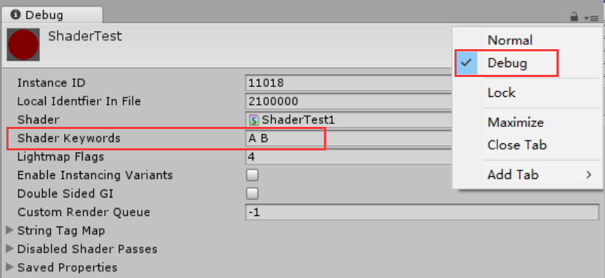
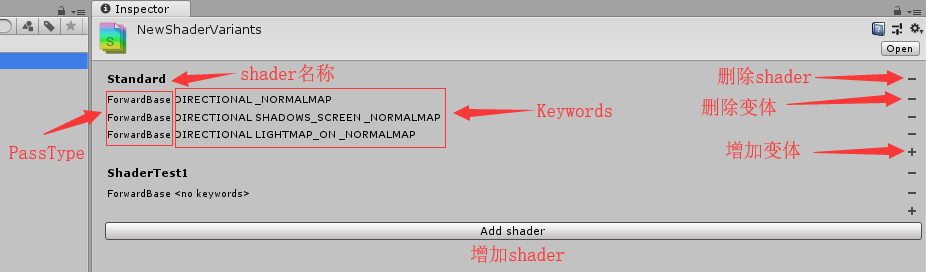
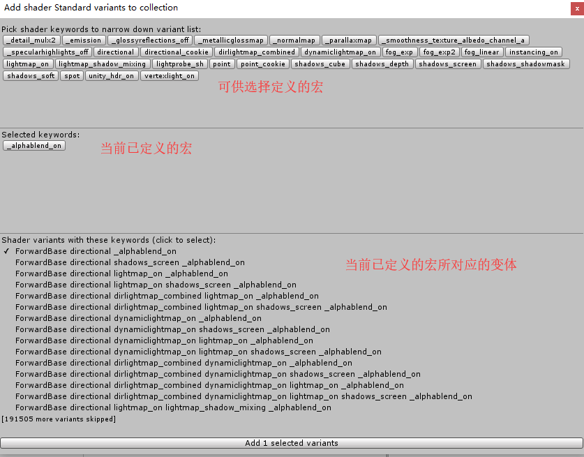
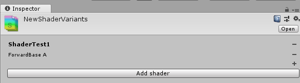
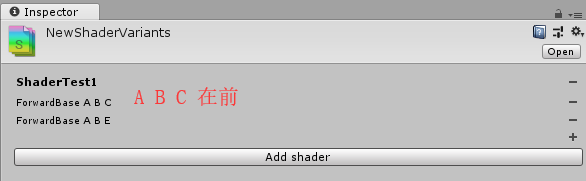
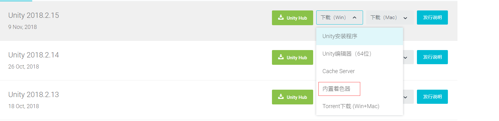

# Shader变体收集与打包

作者：小明

---
<!-- TOC depthFrom:1 depthTo:6 withLinks:1 updateOnSave:1 orderedList:0 -->

- [Shader变体收集与打包](#shader变体收集与打包)
	- [基础知识](#基础知识)
		- [什么是ShaderVariant](#什么是shadervariant)
		- [Material ShaderKeywords与ShaderVariant](#material-shaderkeywords与shadervariant)
		- [multi_compile与shader_feature](#multicompile与shaderfeature)
			- [1.	定义方式](#1-定义方式)
			- [2.	宏的适用范围](#2-宏的适用范围)
			- [3.	变体的生成](#3-变体的生成)
			- [4.	默认定义的宏](#4-默认定义的宏)
	- [如何控制项目中Shader变体的生成](#如何控制项目中shader变体的生成)
	- [使用shader_feature的解决方案：ShaderVariantCollection](#使用shaderfeature的解决方案shadervariantcollection)
		- [ShaderVariantCollection介绍](#shadervariantcollection介绍)
		- [ShaderVariantCollection生成通过shader_feature定义的变体规则](#shadervariantcollection生成通过shaderfeature定义的变体规则)
			- [1.	必定生成首个宏定义开启所对应的变体。](#1-必定生成首个宏定义开启所对应的变体)
			- [2.Shader中有多个Pass时变体的生成规则](#2shader中有多个pass时变体的生成规则)
		- [变体的调用规则](#变体的调用规则)
	- [shader_feature方案项目具体实现方式](#shaderfeature方案项目具体实现方式)
		- [项目中变体的添加](#项目中变体的添加)
		- [Shader编写规范](#shader编写规范)
			- [1.建议使用shader_feature时将定义语句写成完整模式，并且不要在一个语句中定义多个宏。](#1建议使用shaderfeature时将定义语句写成完整模式并且不要在一个语句中定义多个宏)
			- [2.若在shader中使用shader_feature，请为这个shader指定一个CustomEditor](#2若在shader中使用shaderfeature请为这个shader指定一个customeditor)
	- [其他减少项目中变体数量的方案](#其他减少项目中变体数量的方案)

<!-- /TOC -->
## 基础知识

### 什么是ShaderVariant

&emsp;&emsp;在写shader时，往往会在shader中定义多个宏，并在shader代码中控制开启宏或关闭宏时物体的渲染过程。最终编译的时候也是根据这些不同的宏来编译生成多种组合形式的shader源码。其中每一种组合就是这个shader的一个变体(Variant)。


### Material ShaderKeywords与ShaderVariant
&emsp;&emsp;Material所包含的Shader Keywords表示启用shader中对应的宏，Unity会调用当前宏组合所对应的变体来为Material进行渲染。

&emsp;&emsp;在Editor下，可以通过将material的inspector调成Debug模式来查看当前material定义的Keywords，也可在此模式下直接定义Keywords，用空格分隔Keyword。<u>如图1</u>


<br/><font size=2>图1：设置keyword</font></br>

&emsp;&emsp;在程序中，可用Material.EnableKeyword()、Material.DisableKeyword()、Shader.EnableKeyword()、Shader.DisableKeyword()来启用/禁用相应的宏。

&emsp;&emsp;Enable函数应与Disable函数相对应。若一个宏由Material.EnableKeyword()开启，则应由Material.DisableKeyword()关闭，Shader.DisableKeyword()无法关闭这个宏。Material中定义的Keywords由Material的函数进行设置。
### multi_compile与shader_feature
&emsp;&emsp;multi_compile与shader_feature可在shader中定义宏。两者区别如下图所示：

|  | multi_compile | shader_feature |
| - | :-: | :-: |
| 定义方式 | #pragma multi_compile A| #pragma shader_feature A |
| 宏的适用范围 | 所有Shader | 所有Shader |
|变体的生成 | 生成所有的变体 | 可自定义生成何种变体 |
|默认定义的宏 | 默认定义首个宏 | 默认定义首个宏（只有一个宏定义时默认为nokeyword） |


#### 1.	定义方式
&emsp;&emsp;定义方式中值得注意的是，#pragma shader_feature A其实是 #pragma shader_feature _ A的简写，下划线表示未定义宏(nokeyword)。因此此时shader其实对应了两个变体，一个是nokeyword，一个是定义了宏A的。

&emsp;&emsp;而#pragma multi_compile A并不存在简写这一说，所以shader此时只对应A这个变体。若要表示未定义任何变体，则应写为 #pragma multi_compile __ A。
#### 2.	宏的适用范围

&emsp;&emsp;两种定义方式可以使用在任何shader中，只是各自有一些建议使用情况。

&emsp;&emsp;multi_compile定义的宏，如#pragma multi_compile_fog，#pragma multi_compile_fwdbase等，基本上适用于大部分shader，与shader自身所带的属性无关。

&emsp;&emsp;shader_feature定义的宏多用于针对shader自身的属性。比如shader中有_NormalMap这个属性(Property)，便可通过```#pragma shader_feature _NormalMap```来定义宏，用来实现这个shader在material有无_NormalMap时可进行不同的处理。

#### 3.	变体的生成
&emsp;&emsp;multi_compile会默认生成所有的变体，因此应当谨慎适用multi_compile，否则将会导致变体数量激增。如：
    #pragma multi_compile A B C
    #pragma multi_compile D E

&emsp;&emsp;则此时会生成 A D、A E、B D、B E、C D、C E这6中变体。

&emsp;&emsp;shader_feature要生成何种变体可用shader variant collection进行自定义设置。

#### 4.	默认定义的宏
&emsp;&emsp;当material中的keywords无法对应shader所生成的变体时，Unity便会默认定义宏定义语句中的首个宏，并运行相应的变体来为这个material进行渲染。

&emsp;&emsp;multi_compile与shader_feature都默认定义首个宏，如下表所示:

|  宏定义语句 | 默认定义的宏 |
|  :-: | :-: |
| #pragma shader_feature A | nokeyword(存在简写问题)|
| #pragma shader_feature A B C | A |
|#pragma multi_compile A | A |
|#pragma multi_compile A B C | A |


## 如何控制项目中Shader变体的生成

&emsp;&emsp;项目中shader变体的生成方式主要有三种，其优缺点如下图所示：

| 生成方式 | 优点 | 缺点 |
| - | :-: | :-: |
| shader与material打在一个包中 | 变体根据material中的keywords自动生成| 1.	多个不同的material包中可能存在相同的shader变体，造成资源冗余.<br/>2.若在程序运行时动态改变material的keyword，使用shader_feature定义的宏，其变体可能并没有被生成 |
| Shader单独打包，使用multi_compile定义全部宏 | 全部变体都被生成，不会发生需要的变体未生成的情况 | 1.生成的变体数量庞大，严重浪费资源 |
|Shader单独打包，shader_feature（需要使用ShaderVariantCollection生成变体）与multi_compile（还是会生成所有变体）结合使用 | 能够有效控制shader_feature变体数量 | 1.如何确定哪些变体需要生成<br/>2.容易遗漏需要生成的变体，特别是需要动态替换的变体 |


&emsp;&emsp;而我们希望的结果是在保证渲染效果正确的情况下，要尽可能的控制项目中shader的变体数量，避免产生冗余资源。幸运的是，<font size=4>```Unity已经为我们准备好了解决方案：ShaderVariantCollection```</font>。


## 使用shader_feature的解决方案：ShaderVariantCollection
### ShaderVariantCollection介绍
&emsp;&emsp;Shader Variant Collection的其中一个作用就是用来记录shader中使用shader_feature定义的宏产生的变体。能够设置生成何种变体，从而避免生成不必要的变体；shader不必和material打在一个包中，避免了多个包中存在相同的变体资源；明确直观的显示了哪些变体是需要生成的。

&emsp;&emsp;在Unity中可以通过Create->Shader-> Shader Variant Collection，就可以新建一个shader variant collection文件，shader variant collection 的使用<u>如图2</u>所示：


<br/><font size=2>图2</font></br>

&emsp;&emsp;点击增加变体后，会出现变体选择窗口，<u>如图3</u>


<br/><font size=2>图3</font></br>

&emsp;&emsp;配置好需要生成的变体后，将collection与shader打在同一个包中，便能准确生成面板中所配置的shader变体。
### ShaderVariantCollection生成通过shader_feature定义的变体规则
&emsp;&emsp;除了在collection中配置的变体会被生成外，Unity还在后台为我们多生成了几个变体，这几个变体是“隐藏的”，并未在collection面板中显示。
#### 1.	必定生成首个宏定义开启所对应的变体。
&emsp;&emsp;Shader中通过#pragma shader_feature A定义了宏A，并在collection中加入了宏A所对应的变体，<u>如图4</u>所示：


<br/><font size=2>图4</font></br>

&emsp;&emsp;此时生成的变体除了collection中已经存在的ForwardBase A外，还会生成变体ForwardBase nokeyword。因为只定义单个宏时，A 为 _ A的简写。实际上首个被定义的宏为nokeyword，故 nokeyword所对应的变体必定会被生成。

&emsp;&emsp;同理，以 #pragma shader_feature A B C来定义宏时，即使collection中未添加变体Forward A，这个变体也必定会被生成(当shader的PassType仅有ForwardBase)。

#### 2.Shader中有多个Pass时变体的生成规则

&emsp;&emsp;a.读取ShaderVariantCollection中已存在的变体，获取它们的Keywords。

&emsp;&emsp;b.	将这些Keywords分别与每个Pass的多组Keywords列表求交集，取交集中Keywords数量最多得那组。

&emsp;&emsp;c.	用得到的Keywords与对应的PassType生成ShaderVariant，并添加到ShaderVariantCollection中。

&emsp;&emsp;d.	若得到得交集中有新的Keywords，则回到b。
上述过程类似递归。例如：
Shader 中有 ForwardBase、ForwardAdd、Normal 三种PassType(以下为了方便简称Base、Add、 Normal)。定义的宏如下：

|  Base | Add |Normal|
|  :-: | :-: | :-: |
| #pragma shader_feature A<br/> #pragma shader_feature B<br/>#pragma shader_feature C | #pragma shader_feature A<br/>#pragma shader_feature E|#pragma shader_feature A<br/>#pragma shader_feature B<br/>#pragma shader_feature E  |


&emsp;&emsp;此时若ShaderVariantCollection中包含的变体是 Base ABC，Add AE。则此时生成的变体为：这三种PassType的默认定义的宏(nokeyword)所对应的变体(3个)以及原先直接包含的Base ABC、Add AE。除此之外Unity还会额外生成Add A、Base A、Normal A、Normal AB、 Base AB、Normal AE这6个变体。

    ABC ∩ Add AE -> Add A (A is NewKeyword)
      A ∩ Base ABC -> Base A
      A ∩ Normal ABE -> Normal A
    ABC ∩ Normal ABE -> Normal AB (AB is NewKeyword)
      AB ∩ Base ABC -> Base AB
    AE ∩ Normal ABE -> Normal AE

### 变体的调用规则

&emsp;&emsp;当collection将变体准确生成后，便能在运行时通过修改material中的keywords来实现对不同变体的调用。

&emsp;&emsp;假设某collection生成的变体只有Forward ABC，Forward ABE，Forward nokeyword这三种，则此时调用关系如下：

|  Material中的Keywords | 调用的变体 | 解释|
|  :-: | :-: | :-: |
| A B C | Forward A B C|正常匹配|
| A B | Forward nokeyword |没有匹配的变体，调用首个被定义的宏 所对应的变体|
|A B C D  | Forward A B C  |调用交集中keyword数量多的变体<br/> ABCD ∩ ABC = ABC<br/> ABCD ∩ ABE = AB|
|A B C E | Forward A B C |交集中keyword数量相同，在collection中谁在前就调用谁|
|A B E C | Forward A B C |与在material中的定义顺序无关|


<br/><font size=2>图5</font></br>
&emsp;&emsp;<font size=4>```以上均为根据测试结果总结归纳出来的规则，若有错误之处还请严加指正！```</font>


## shader_feature方案项目具体实现方式
### 项目中变体的添加
&emsp;&emsp;那么项目中是如何确定哪些变体是需要加到collection中的呢？我们的做法是：

&emsp;&emsp;a.	遍历每一个Material，提取其shader keywords。

&emsp;&emsp;b.	将获得的keywords与shader的每个PassType所包含的宏定义做交集，并将其结果添加到collection中。

&emsp;&emsp;举个简单的例子：

&emsp;&emsp;Material中的Keywords为A B C D，则shader的PassType、PassType中所定义的宏、需要往collection中添加的变体则如下表所示：

|  PassType | 定义的宏 | 需要往collection中添加的变体|
|  :-: | :-: | :-: |
|  ForwardBase| #pragma shader_feature A<br/>#pragma shader_feature B| Forward A B<br/>(ABCD ∩ AB = AB)|
|  ForwardAdd | #pragma shader_feature _ C D | Add C<br/>(ABCD ∩ C = C，ABCD ∩ D = D，但C的定义在D前，故只添加C)|
 |Normal|#pragma shader_feature _  E F|Normal NoKeyword<br/>(ABCD ∩ E = NoKeyword)<br/>(ABCD ∩ F = NoKeyword)|

&emsp;&emsp;需要说明的是，我们自己的代码里为了降低变体生成逻辑的复杂度、保持collection面板上变体的直观性，不将Unity为我们额外生成的那几个变体添加到collection面板中，但要记得Unity是会为我们生成额外的变体的。

### Shader编写规范

#### 1.建议使用shader_feature时将定义语句写成完整模式，并且不要在一个语句中定义多个宏。

&emsp;&emsp;完整模式：#pragma shader_feature _ A，不建议写成#pragma shader_feature A。

&emsp;&emsp;不建议在一个语句中定义多个宏，如： #pragma shader_feature _ A B C，若一定要定义多个宏，请务必将其写成完整模式，不使用完整模式在切换shader时可能会与想要的效果不一致，具体原因尚未测得。

#### 2.若在shader中使用shader_feature，请为这个shader指定一个CustomEditor

&emsp;&emsp;每个使用shader_feature来定义Keyword的shader都需要再末尾加个 CusomEditor “xxxx”，并在代码中实现类xxxx(需继承自UnityEditor.ShaderGUI)，用来对Keywords定义进行设定。

&emsp;&emsp;这么做是因为Material中的部分Keyword是由shader中的属性(Properties)所控制的。比如shader中含有_NormalMap的属性并且定义了与_NormalMap相关的Keyword，这个Keyword需要在Material含有NormalMap时添加，不含NormalMap时移除。这个功能可由自定义的CustomEidtor实现。

&emsp;&emsp;具体如何写这个CustomEditor类可参考Unity builtin_shaders\Editor\StandardShaderGUI.cs。该文件可去Unity官网下载，下载时选择内置着色器即可。如<u>图6</u>

<br/><font size=2>图6</font></br>
<br/>

## 其他减少项目中变体数量的方案

1.<font size=4>```在使用ShaderVariantCollection收集变体打包时，只对shader_feature定义的宏有意义，multi_compile的变体不用收集也会被全部打进包体```</font>。

2.<font size=4>```内存中ShaderLab的大小和变体成正比关系。从减少内存方面应该尽量减少变体数量，可以使用 #pragma skip_variants```</font>。

3.<font size=4>```ShaderLab在相关shader加入内存时就已经产生，但如果没有被渲染的话不会触发CreateGPUProgram操作，如果提前在ShaderVariantCollection中收集了相关变体并执行了warmup的话，第一次渲染时就不会再CreateGPUProgram，对卡顿会有一定好处```</font>。

4.<font size=4>```2018.2新功能OnProcessShader可以移除无用的shader变体。比#pragma skip_variants更合理```</font>。

5.<font size=4>```项目前期介入美术效果制作流程，规范shader宏定义使用，防止TA为了美术效果过度使用宏定义的情况，以过往项目经验来看，到后期进行此项工作导致的资源浪费非常之大```</font>。
