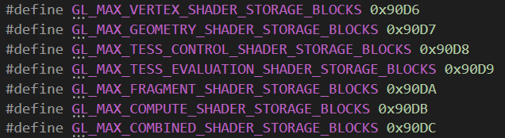

# StructuredBuffer测试报告

作者：二点五次元

---

## 测试原因
&emsp;&emsp;在测试Compute Shader功能的过程中,发现OpenGL ES 3.1且Shader Model 4.5的Android手机上无法运行Compute Shader，而调用Unity的supportsComputeShaders返回的值是True。在寻找其原因的过程中，发现在 https://zhuanlan.zhihu.com/p/53785954 一文中提到，某些OpenGL ES 3.1的手机只支持在片元着色器内访问StructuredBuffer。而OpenGL ES提供了API可以访问到Shader中各个阶段所能使用的StructuredBuffer的数量。因此做了如下测试，去<font size=4>```获取到StructuredBuffer的可用数量，以分析此数据是否和支持Compute Shader的情况有关系```</font>。

## 实现原理
&emsp;&emsp;<font size=4>```利用OpenGL ES的API glGetIntegerv可以访问到StructuredBuffer的数量```</font>。在OpenGL ES库的头文件中我们可以找到获取着色器不同阶段的枚举。<u>如图1</u>


<br/><font size=2>图1. OpenGL ES 里获取着色器不同阶段的枚举</font></br>

&emsp;&emsp;调用glGetIntegerv(GLenum pname, GLint * params)，其中的pname参数传入相应的枚举值，就可以得到对应的结果。需要注意在调用OpenGL ES的API之前，要先设置当前的Context。由于C#中无法直接调用OpenGL ES，所有调用的代码均在C++中实现，封装好相应的函数再由C#调用。Android下利用JNI将C++代码编译成.so文件。
## 测试结果

#### Android测试

1、	Samsung Galaxy S8

测试数据如下：

    OpenGL ES version：OpenGL ES 3.2
    Shader Model：5.0
    VertexShaderStorageBlocks：4
    GeometryShaderStorageBlocks：4
    TessControlShaderStorageBlocks：4
    TessEvaluationShaderStorageBlocks：4
    FragmentShaderStorageBlocks：4
    ComputeShaderStorageBlocks：24
    CombinedShaderStorageBlocks：24
&emsp;&emsp;运行相应的Shader代码测试，此处只验证了顶点，片元和Compute Shader的结果。当访问的StructuredBuffer超过上述数量时，shader确实无法运行，验证通过。

2、	Samsung Galaxy Note8

测试数据如下：

    OpenGL ES version：OpenGL ES 3.2
    Shader Model：5.0
    VertexShaderStorageBlocks：4
    GeometryShaderStorageBlocks：4
    TessControlShaderStorageBlocks：4
    TessEvaluationShaderStorageBlocks：4
    FragmentShaderStorageBlocks：4
    ComputeShaderStorageBlocks：24
    CombinedShaderStorageBlocks：24
&emsp;&emsp;运行相应的Shader代码测试，顶点、片元及Compute Shader均与所标记的使用个数一致，验证通过。

3、HUAWEI Mate 9

测试数据如下：

    OpenGL ES version：OpenGL ES 3.2
    Shader Model：5.0
    VertexShaderStorageBlocks：0
    GeometryShaderStorageBlocks：0
    TessControlShaderStorageBlocks：0
    TessEvaluationShaderStorageBlocks：0
    FragmentShaderStorageBlocks：35
    ComputeShaderStorageBlocks：35
    CombinedShaderStorageBlocks：35
&emsp;&emsp;在HUAWEI Mate 9上，片元着色器验证通过，的确能最多访问35个StructuredBuffer。但Compute Shader验证发现有问题，虽然数据上返回的是35个，但实验发现最多只能访问24个。（Fragment中使用还是35个）

&emsp;&emsp;另外使用WeTest测试222台手机，[点击查看测试数据](https://github.com/Nicholas10128/AAAResearch/blob/master/Experiences/StructuredBuffer%E6%B5%8B%E8%AF%95%E6%8A%A5%E5%91%8A/Image/Structured%20Buffer%E5%9C%A8WeTest-Android%E5%90%84%E6%9C%BA%E5%9E%8B%E6%94%AF%E6%8C%81%E6%83%85%E5%86%B5.md)

#### iOS测试

&emsp;&emsp;iOS上的OpenGL ES版本只支持到OpenGL ES 3.0，该版本不支持GL_MAX_VERTEX_SHADER_STORAGE_BLOCKS等参数，无法获取相应的值。
根据苹果开发者网站上的文档 https://developer.apple.com/metal/Metal-Feature-Set-Tables.pdf ，我们可以找到相应的数据。

&emsp;&emsp;该条目给出了苹果设备在每次绘制以及每个Compute函数中所能访问的最多的StructuredBuffer的数量。在iPhone7上进行验证，运行相应的Shader代码，发现当单独在顶点或单独在片元中访问超过31个StructuredBuffer时，Shader将无法正常绘制。而顶点与片元同时访问了StructuredBuffer并且总数超过31个时会导致整个游戏黑屏。

## 测试结论

1、从222台测试手机的数据来看，<font size=4>```在Android设备中，OpenGL ES 3.0及以下的手机，均不支持访问StructuredBuffer，而OpenGL ES 3.1及以上手机中各个着色阶段支持的StructuredBuffer情况，根据不同的手机硬件也各不相同```</font>。

2、对于Android手机，如果工程打包时选择了Vulkan，StructuredBuffer使用数量的情况和OpenGL ES相同。

3、<font size=4>```Metal下，整个着色器阶段中或者一个ComputeShader中支持31个StructuredBuffer```</font>。

4、<font size=4>```Compute Shader能否在手机上运行与能否访问StructuredBuffer并无本质联系```</font>。目前的结论依然是Shader Model 5.0（OpenGL ES 3.1分为Shader Model 4.5 和 Shader Model 5.0两类机型）的设备上可以使用Compute Shader，因此ShaderModel4.5的手机即便获取到Compute Shader中支持sBuffer的数量，实际运行也没有意义。

5、<font size=4>```获取的访问存储块数量的接口，仅限于sBuffer数量的限制，与读取贴图的多少没有关系```</font>。

## 问题记录&使用建议

1、测试过程中，发现Android设备上有些测试数据与Shader实际运行的情况不符，例如HUAWEI Mate 9中，Compute Shader中的SBuffer数量利用API获取到的是35个，然而实际测试只能使用24个，具体原因未知。<font size=4>```建议在使用时最好按照不超过24个，这样可以做到最大兼容```</font>。

2、Metal中是否有相应的API方法可以获取到StructuredBuffer使用数量还有待研究，目前仅是从官方文档以及对部分手机进行测试来得到相关数据，<font size=4>```此数据已经经过真机验证符合预期```</font>。

3、<font size=4>```vivo Y83A，vivo Y81S,Meitu V6,乐视X600等几台ShaderModel5.0的手机，收集上来的数据支持数量都是0，但实际运行是可以支持sBuffer```</font>，原因待查（据一位前辈说，这种可能是驱动实际支持了（或者部分支持），对外宣称不支持，因为如果说支持，就要宣布自己通过了khronos的conformance test，而驱动厂商可能支持支持了该feature的一部分了，所以对我们来说只能认为它不支持了），<font size=4>```所以此种设备建议认为不支持```</font>。

4、<font size=4>```由于有很多Android设备只在片元计算中支持sBuffer，所以为了兼容建议在顶点渲染中都不使用sBuffer，改为使用RT替代```</font>。也可以根据设备支持sBuffer的情况具体分析实现，此种方法复杂度过于高，不利于维护，但这样确实能拔高高端机型的表现效果，所以取舍看官自定。

<font size=4>```PS：由于手机只有200+台，没有覆盖到所有机器进行完全测试，如果有个别机型与以上反馈不匹还请谅解，方便的话也请反馈给我们，谢谢！```</font>  
